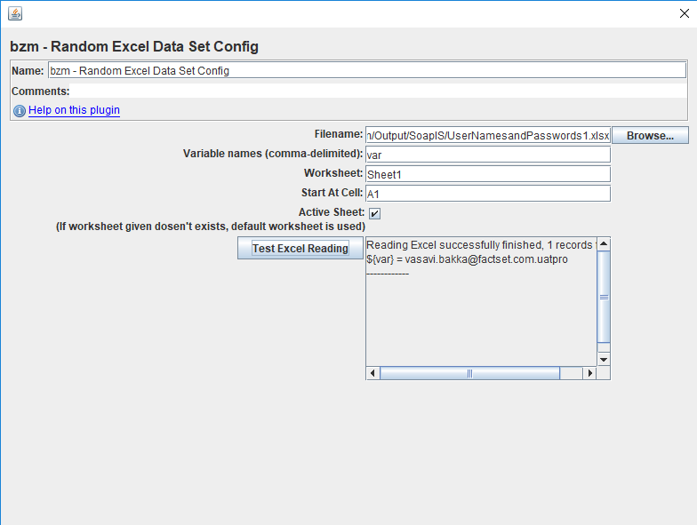

# Random Excel Data Set Config 

Random Excel Data Set Config is used to read Excel rows from file, split and put them into JMeter variables in random order.

This plugin has following options that affect the behavior:
  * `Filename` - path to Excel file. Relative path are resolved with respect to the path of the active test plan. For distributed testing, the Excel file must be stored on the server host system in the correct relative directory to where the JMeter server is started.;
  * `Variable Names` - list (comma-separated) of variable names;
  * `Worksheet` - Name of the worksheet to work with;
  * `Start At Cell` - Format -> exmaple: A1 , where A is column name and 1 is row number to start working with;
  * `Active Sheet` - If enabled, and given worksheet dosen't exists, then default workshhet is picked automatically, ie. the worksheet which opens automatically when the partucular xlsx file is opened;

_***At the beginning of the test, the config reads file. There are a delay and a large memory consumption for large files.***_

_In preview area shows only 20 records from Excel file._

